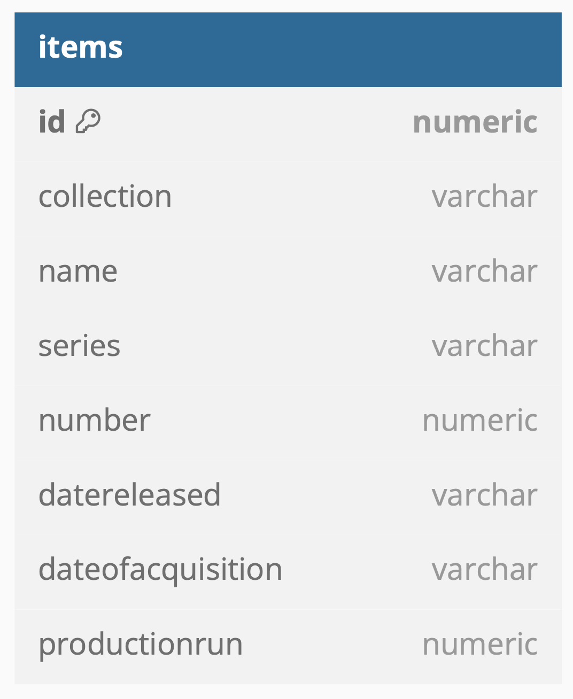
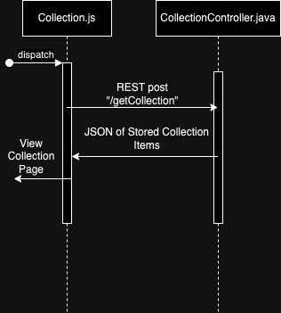
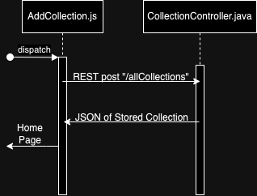
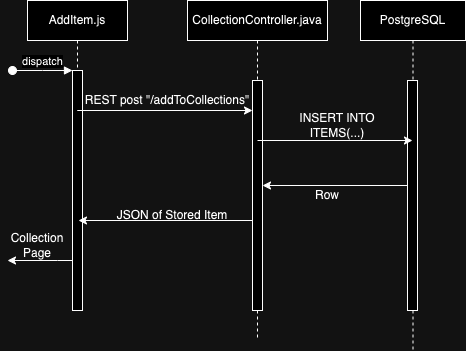

# Collection-Hub
A solution to tracking what collectibles you own and desire

***Video Demo***

[](https://youtu.be/yAy1i4QA6D8)

***Tech Stack***

 - Database: PostgreSQL
 - Back-end: Java Spring Boot
 - Web Front-end: React JS

 

***Build Instructions***

**Database**

From root directory, run the following command...
```
RUN brew services start postgresql &&
psql postgres
```
Or...
```
RUN psql postgres
```
If PostgreSQL is already running on your server.


**Back-end**

From root directory, run the following command...
```
RUN cd backend/collectionHub &&
./mvnw clean &&
./mvnw spring-boot:run
```

To run the backend unit tests, from the root directory, run the following command...
```
RUN cd backend/collectionHub &&
mvn test
```


**Web Front-end**

From root directory, run the following command...
```
RUN cd web/collection-hub &&
npm start
```

To run the web frontend unit test, from the root directory, run the following command...
```
RUN cd web/colleection-hub &&
npm test
```


***Design***

**Relational Schema**



**Home Page Sequence**


**View Collection Page Sequence**



**Add Collection Page Sequence**



**Add Item Page Sequence**

